# VBAMatrices

Matrix manipulation in Excel.

Currently supported operations are:

+ LU decomposition
+ Exponentiation
+ Determinant
+ Inverse
+ Sum
+ Difference
+ Product
+ Solving a system of $`n`$ linear equations in $`n`$ unknowns
+ QR decomposition

More to come!


## Contents

1. [How to use.](#how-to-use)
    1. [Adding a button to the **Quick Access Toolbar**](#adding-a-button-to-the-quick-access-toolbar)
    2. [Using the form](#using-the-form)
2. [Examples.](#examples)
    1. [Linear systems](#linear-systems)
    2. [Exponentiation](#exponentiation)
    3. [LU decomposition](#lu-decomposition)
    4. [Determinant](#determinant)
    5. [Inverse](#inverse)
    6. [QR decomposition](#qr-decomposition)

## How to use

### Adding a button to the **Quick Access Toolbar**

To get started do the following:

1. import the files located in the **Modules** and **Forms** directories into a VBA project;
2. from the **Quick Access Toolbar** navigate to

**Customize Quick Access Toolbar** -> **More commands...** -> **Choose commands from** ->
**Macros**

and select **show_MatOps**, then click **Add >>**. Additionally you can then select **Modify** and choose an icon (e.g. an identity matrix of deegre 2). Commit the changes by clicking the **OK** button.

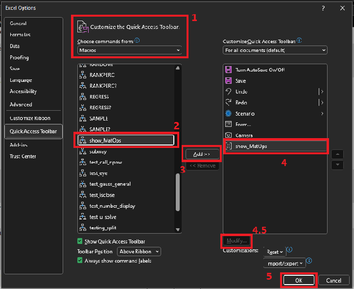
<br>
*Figure 1: Adding a button to Quick Access Toolbar.*

3. Now you are able to call the form from the **Quick Access Toolbar** anywhere you are in the workbook.

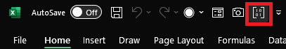
<br>
*Figure 2: MatOps button.*

### Using the form

Click the MatOps icon in the **Quick Access Toolbar**. A form window pops up.

+ Number of matrices frame: specify whether a single or multiple matrices are involved in
the operation.
+ Select cells button: use it to specify the input; if multiple matrices are used, separate
the ranges with a comma or drag with a mouse while pressing down CTRL button.
+ Single matrix frame: operations which can be performed on a single matrix; multiple options are
allowed to be selected.
+ Multiple frame: operations involving multiple matrices (possibly more than two).

> **Note**<br>
> The *Solve a system* option requires the input to be in the form of a matrix and a column
> vector (see [Examples](#examples)). This option supports systems of $`n`$ equations in $`n`$
> unknowns.

+ Clicking the **OK** button creates a new worksheet with the output.

## Examples

The following examples can be found in the `examples.xlsm` workbook.

### Linear systems

Consider the following system of 4 equations in 4 unknowns:

```math
    \begin{cases}
        2 x_1 = 3,\\[1ex]
        x_1 + \frac{3}{2} x_2 = \frac{9}{2},\\[1ex]
        -3 x_2 + \frac{1}{2} x_3 = - \frac{33}{5},\\[1ex]
        2 x_1 - 2 x_2 + x_3 + x_4 = \frac{4}{5}.
    \end{cases}
```

Write it in a matrix form:

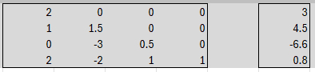
<br>
*Figure 3: Matrix form of the system in Excel.*

Using the MatOps form select the two ranges as a multiple selection (either separating them with
a comma or dragging with a mouse and pressing down the CTRL button).


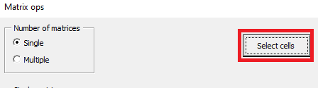
<br>
*Figure 4: **Select cells** button shows a dialog box for specyfing input.*

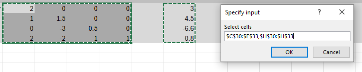
<br>
*Figure 5: Select two ranges: the matrix and the column vector respectively.*

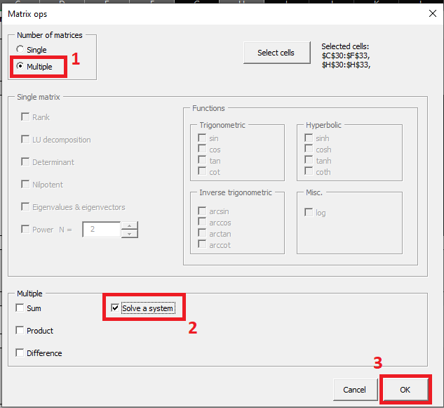
<br>
*Figure 6: Select options on the form.*

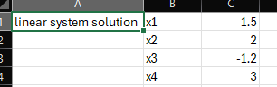
<br>
*Figure 7: The result.*

> **Note**<br>
> The support of the solver is limited to systems for which a unique solution exists.

### Exponentiation

Suppose you want to raise the matrix seen in the figure 8 to the 20th power. To do so follow
the steps depicted in figures 9 and 10.

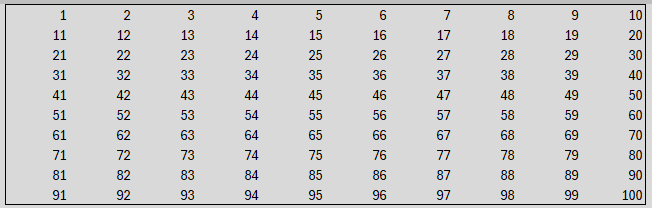
<br>
*Figure 8: A $`10 \times 10`$ matrix.*

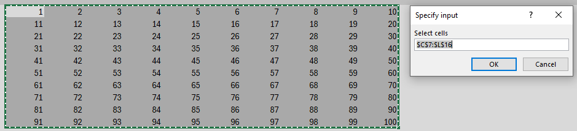
<br>
*Figure 9: Select the range.*

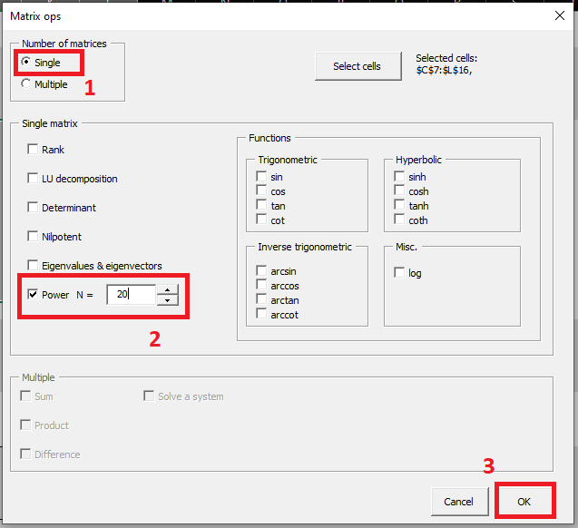
<br>
*Figure 10: Select appropriate operation.*

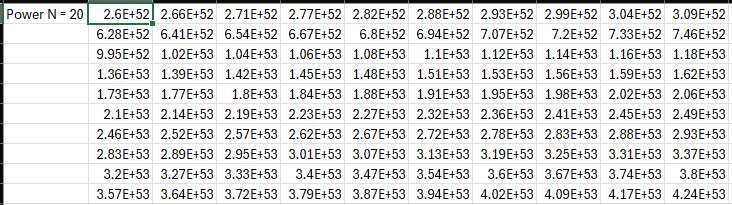
<br>
*Figure 11: The result.*

### LU decomposition

For any square matrix $`A`$ there exist matrices $`P`$, $`L`$ and $`U`$ such that $`PA = LU`$,
where $`P`$ is a permutation matrix, $`L`$ is a lower triangular matrix with ones on the main
diagonal, and $`U`$ is an upper triangular matrix. This is what we mean by LU decomposition
(with $`P`$ quietly implied). Note that $`PA = LU`$ iff $`A = P^{-1}LU`$. In Excel the result
of the decomposition is given in this form.

Suppose you want to find an LU decomposition of the matrix in the figure 12.

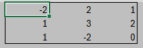
<br>
*Figure 12: A matrix before LU decomposition.*

Consult the figure 13 below.

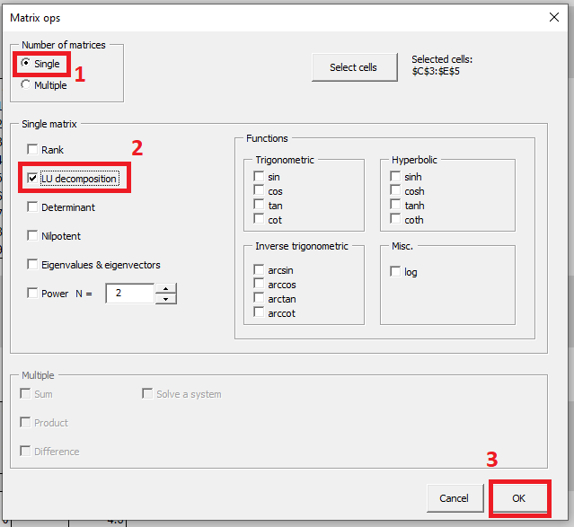
<br>
*Figure 13: Select appropriate action.*

The result in the figure 14 consists of the matrices $`P^{-1}`$, $`L`$, $`U`$ respectively.
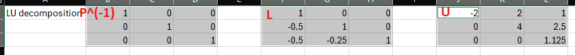
<br>
*Figure 14: Matrices $`P^{-1}`$, $`L`$, $`U`$.*

### Determinant

In order to compute the determinant of a matrix refer to the figures 15 - 17.
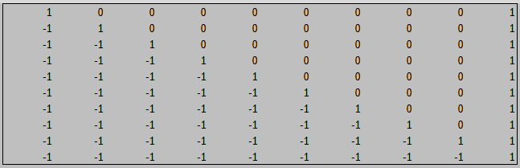
<br>
*Figure 15: A 10 by 10 matrix.*

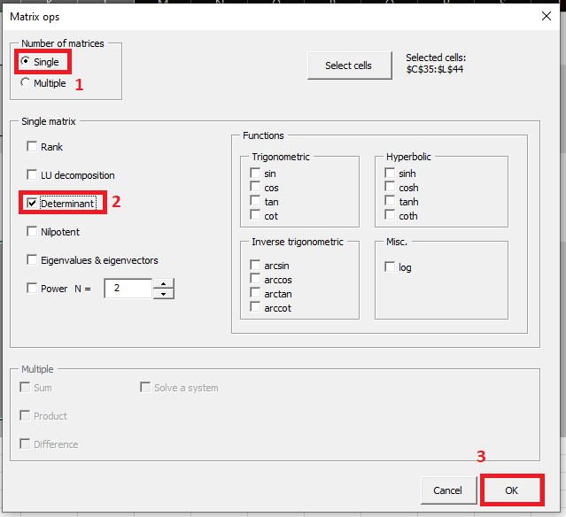
<br>
*Figure 16: Choose appropriate action.*

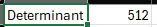
<br>
*Figure 17: The result.*


### Inverse

Consider the following matrix:

```math
    \begin{bmatrix}
        1 & 2 & 3 & \dots & n\\
        2 & 3 & 4 & \dots & 1\\
        3 & 4 & 5 & \dots & 2\\
        \vdots & \vdots & \vdots & \ddots & \vdots\\
        n & 1 & 2 & \dots & n - 1
    \end{bmatrix},
```
where $`n \in \mathbb{N}`$. We are going to evaluate the inverse of this matrix for $`n = 20`$.

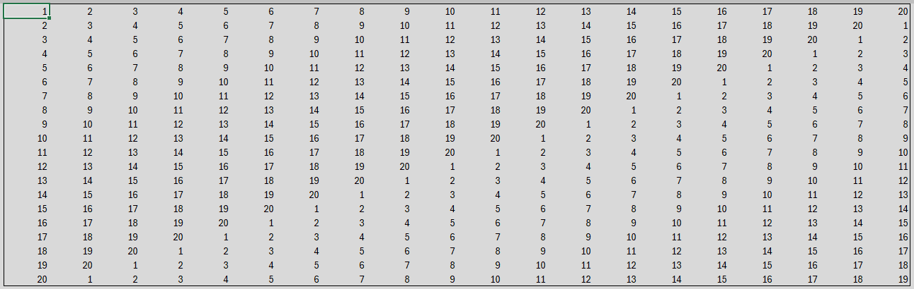
<br>
*Figure 18: The matrix.*

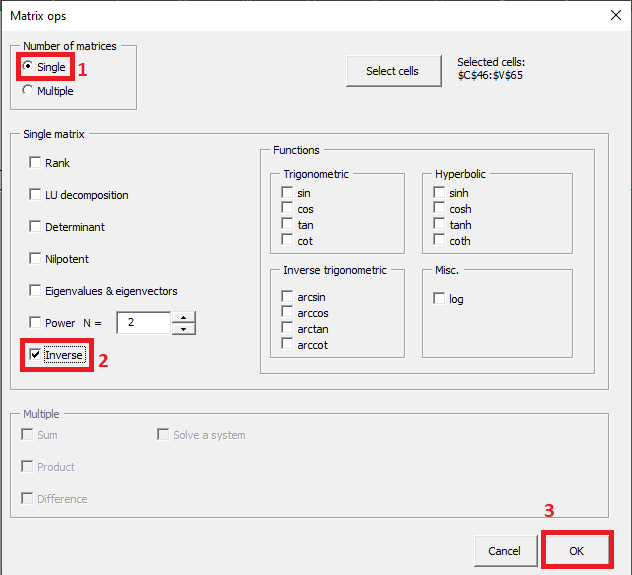
<br>
*Figure 18: The form.*

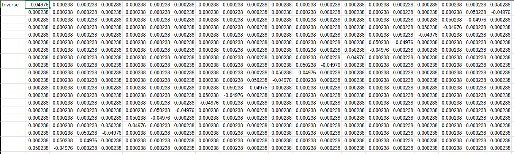
<br>
*Figure 19: The result.*

The reader is encouraged to verify the result by computing the appropriate product.

### QR decomposition

Given a matrix $`A \in \mathbb{R}^{m\times n}`$ with $`m \ge n`$ this routine computes matrices $`Q \in \mathbb{R}^{m\times m}`$ and $`R \in \mathbb{R}^{m\times n}`$ such that
```math
    A = QR, \quad QQ^t = Q^tQ = I_m
```
and $`R`$ is upper triangular.

Consider the example shown in figures 20-22.

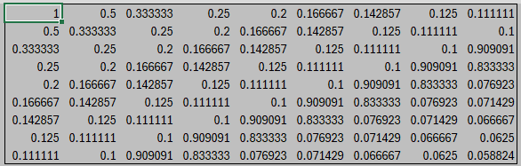
<br>
*Figure 20: The input matrix.*

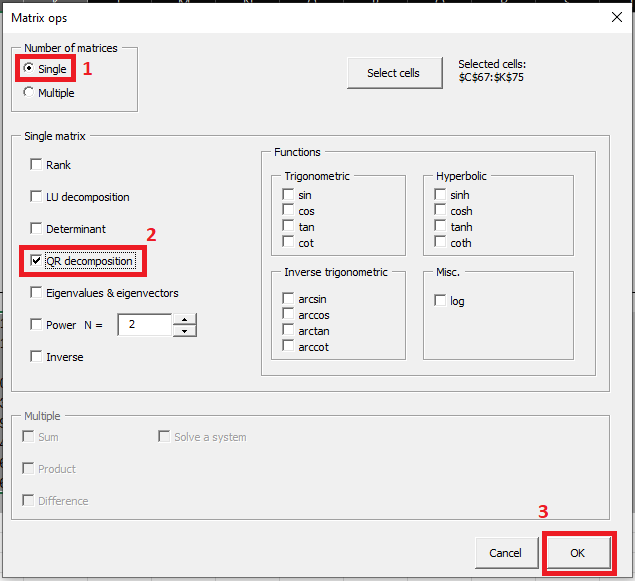
<br>
*Figure 20: The form.*


<br>
*Figure 20: The result.*

The reader is encouraged is compute the product $`QR`$ and compare it with the input matrix.
